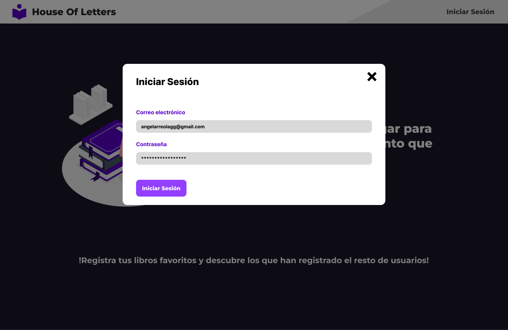
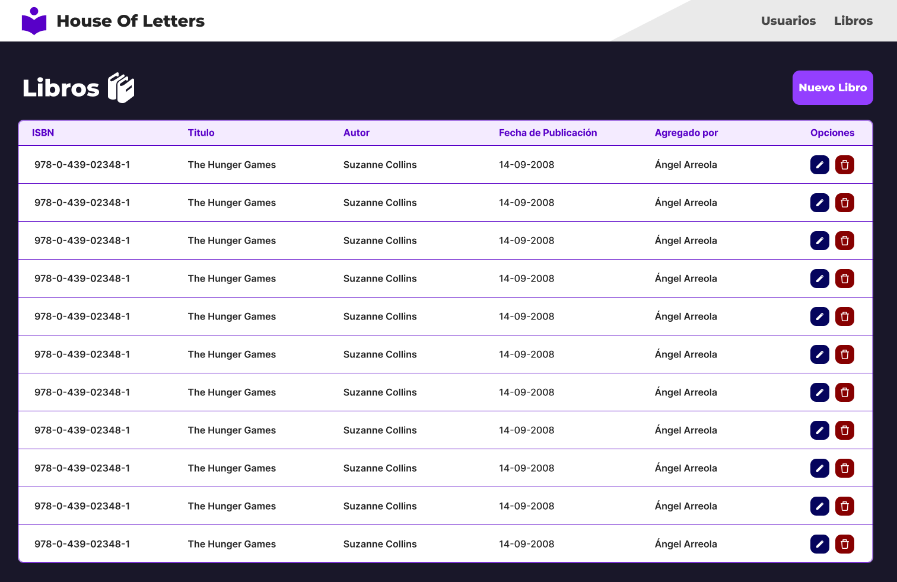
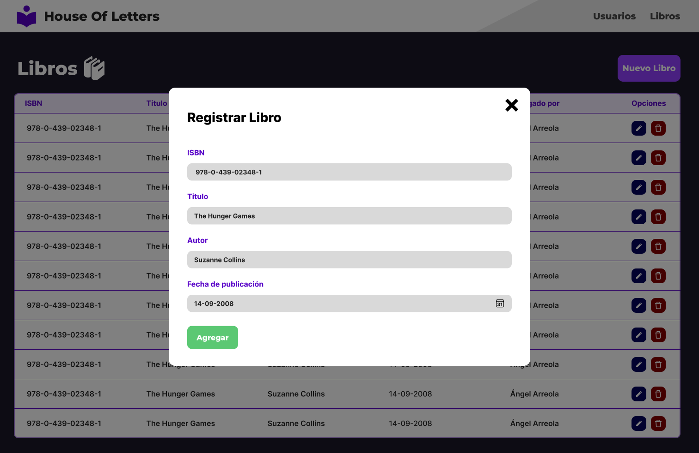
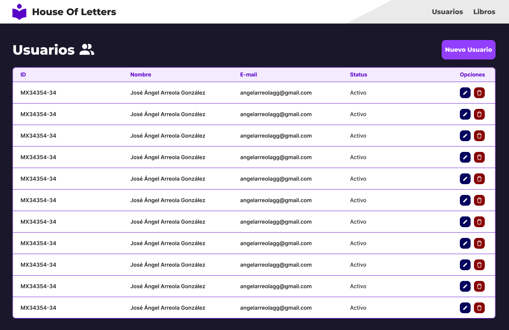
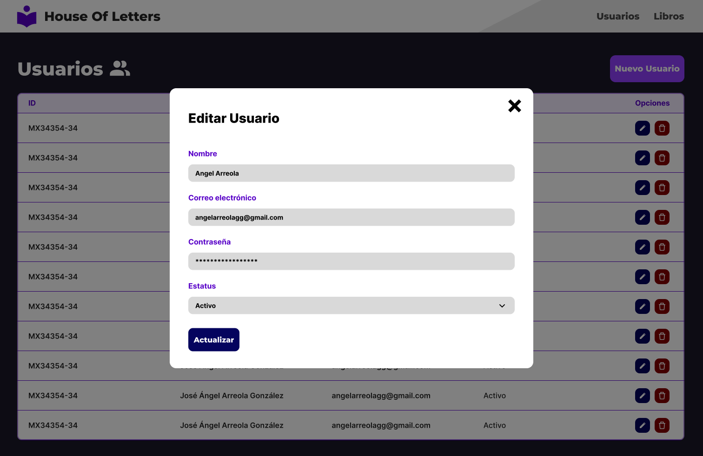

# House Of Letters - Biblioteca Digital Assessment

Este proyecto es un sistema para una biblioteca digital en el cual se permite el registro de usuarios y libros. Cada usuario puede registrar múltiples libros.

## Descripción del Proyecto 📕

El objetivo del proyecto fue crear un sistema de gestión para una biblioteca que permita el registro y gestión de usuarios y libros. A continuación, se detallan las tecnologías utilizadas y las características del sistema.

## Diseño de la Aplicación 💻

El diseño de la aplicación se realizó en [Figma](https://www.figma.com), buscando un diseño limpio, organizado y responsive.

[!Consulta el diseño aqui!](https://www.figma.com/design/rXnMg7GOYskW6jZiBNFOao/DI-Assestment?node-id=0-1&t=6l0E2V36XosTToEF-1)


---








## Backend 🐳
Para la creación del backend se utilizó Node.js, Express, JWT y Sequelize como ORM. El backend no está completamente optimizado, pero cumple con los requisitos del assessment técnico.

### Tecnologías Utilizadas

- **Node.js**
- **Express**
- **JWT (JSON Web Tokens)**
- **Sequelize**

### Funcionalidades

- Lectura, Registro, edición, eliminación y autenticación de usuarios
- Lectura, Registro, edición y eliminación de libros
- Protección de rutas mediante JWT

## Frontend 🍰

El frontend se construyó usando React.js y TailwindCSS. Además, se usaron algunas animaciones con framer-motion y se manejó el enrutamiento con react-router-dom.

### Tecnologías Utilizadas

- **React.js**
- **TailwindCSS**
- **framer-motion** (para animaciones)
- **react-router-dom** (para enrutamiento)

### Funcionalidades

- Registro y autenticación de usuarios
- Registro, edición y eliminación de libros
- Protección de rutas

## Base de Datos

Se utilizó MySQL como base de datos. El esquema de la base de datos se encuentra dentro de la carpeta `db` del proyecto.

## Pendientes

Lo único que no se logró a tiempo fue la recarga del componente de usuarios y libros al momento de realizar una alta o modificación, debido a limitaciones de tiempo. 🫠

## Conclusión

Este proyecto cumple con los requisitos del assessment técnico de Digital Ignition, proporcionando un sistema funcional para la gestión de una biblioteca digital.

## Instalación y Ejecución

Para ejecutar el proyecto, sigue los siguientes pasos:

1. Clona el repositorio:
    ```bash
    git clone https://github.com/tu_usuario/tu_repositorio.git
    ```
2. Instala las dependencias del backend:
    ```bash
    cd Project/library_backend
    npm install
    cd src
    ```
3. Configura las variables de entorno para la base de datos y JWT.
4. Inicia el servidor del backend:
    ```bash
    node app.js
    ```
5. Instala las dependencias del frontend:
    ```bash
    cd Project/library_frontend
    npm install
    ```
6. Inicia el servidor del frontend:
    ```bash
    npm run dev
    ```